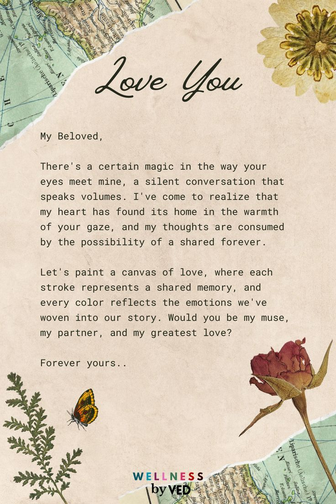

# 💖 For My Love, Aswathy! 💖

This is a **super cute interactive card** for my love! Click the **heart** to reveal a sweet message, enjoy adorable animations, and explore lovely cards.

## 🚀 How to Set Up  
1. Create a **new GitHub repository**.  
2. Copy and paste the files into the repository.  
3. Upload images inside an **`images/`** folder.  
4. Enable **GitHub Pages** in Settings > Pages.  
5. Share the **live link** with Aswathy! ❤️

## 📁 Folder Structure  
```
/cute-card
│── index.html        # Main HTML file  
│── style.css         # CSS for styling  
│── script.js         # JavaScript for animations  
│── images/           # Folder for cute images  
│── README.md         # Instructions for GitHub  
```

## 📜 Code Preview  

### 📌 `index.html`
```html
<!DOCTYPE html>
<html lang="en">
<head>
    <meta charset="UTF-8">
    <meta name="viewport" content="width=device-width, initial-scale=1.0">
    <title>For My Love ❤️</title>
    <link rel="stylesheet" href="style.css">
</head>
<body>

    <div class="container">
        <h1>💖 Hi My Love, Aswathy! 💖</h1>
        <p>Click the heart below to see something special!</p>
        
        <div class="heart-container" onclick="showMessage()">
            
        </div>
        
        <div class="message">
            <h2>💌 My Sweet Message 💌</h2>
            <p>You are the most beautiful person in my life. I love you endlessly! 🥰</p>
            
        </div>
    </div>

    <script src="script.js"></script>

</body>
</html>
```
